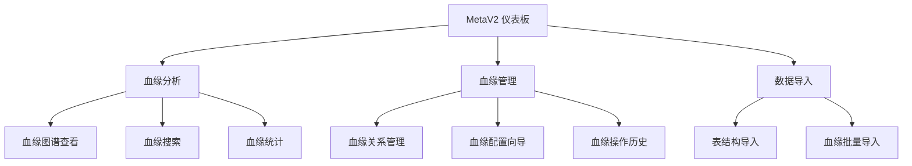

# 血缘管理界面重新设计方案

## 📐 整体架构设计

### 核心设计理念
- **单一职责**：每个页面有明确、单一的核心功能
- **操作就近**：相关功能尽可能靠近，减少用户操作路径
- **搜索优先**：以搜索为中心的血缘管理体验
- **一致性**：统一的交互模式和视觉语言

### 新的导航结构



## 🎨 新页面设计方案

### 1. **血缘分析页面** (LineageAnalysis) `/lineage`
**功能定位**：血缘关系查看、分析和搜索

```
┌─────────────────────────────────────────────────────────────┐
│ 🔍 血缘搜索                                               │
│ ┌─────────────┐ ┌─────────┐ ┌─────────────┐ ┌─────────┐    │
│ │ 搜索框       │ │ 表筛选   │ │ 关系类型筛选 │ │ 时间筛选 │    │
│ └─────────────┘ └─────────┘ └─────────────┘ └─────────┘    │
├─────────────────────────────────────────────────────────────┤
│ 📊 血缘概览统计                                             │
│ ┌─────────┐ ┌─────────┐ ┌─────────┐ ┌─────────┐             │
│ │ 总表数   │ │ 总血缘数 │ │ 今日新增 │ │ 活跃节点 │             │
│ └─────────┘ └─────────┘ └─────────┘ └─────────┘             │
├─────────────────────────────────────────────────────────────┤
│ 🕸️ 血缘图谱                                                │
│ ┌─────────────────────────────────────────────────────────┐ │
│ │                                                       │ │
│ │                    Cytoscape 图谱                      │ │
│ │                                                       │ │
│ │                                                       │ │
│ │                                                       │ │
│ └─────────────────────────────────────────────────────────┘ │
├─────────────────────────────────────────────────────────────┤
│ 📋 血缘关系列表（支持排序、筛选、批量操作）                     │
│ ┌─────────────────────────────────────────────────────────┐ │
│ │ 源表 │ 目标表 │ 关系类型 │ 创建时间 │ 操作[编辑|删除]    │ │
│ └─────────────────────────────────────────────────────────┘ │
└─────────────────────────────────────────────────────────────┘
```

### 2. **血缘管理页面** (LineageManagement) `/lineage-management`
**功能定位**：血缘关系的CRUD操作和配置管理

```
┌─────────────────────────────────────────────────────────────┐
│ ⚙️ 血缘配置工具栏                                           │
│ ┌─────────────┐ ┌─────────────┐ ┌─────────────┐             │
│ │ 新建表血缘   │ │ 新建字段血缘 │ │ 批量导入     │             │
│ └─────────────┘ └─────────────┘ └─────────────┘             │
├─────────────────────────────────────────────────────────────┤
│ 🔍 血缘关系搜索与筛选                                        │
│ ┌───────────────────────┐ ┌─────────────────────┐          │
│ │ 搜索框（表名/字段名）     │ │ 筛选器（关系/时间/状态） │          │
│ └───────────────────────┘ └─────────────────────┘          │
├─────────────────────────────────────────────────────────────┤
│ 📊 血缘关系管理表格                                          │
│ ┌─────────────────────────────────────────────────────────┐ │
│ │ □ 源表 │ 目标表 │ 关系类型 │ 字段映射 │ 状态 │ 操作 │     │ │
│ │ □ 表A │ 表B   │ ETL     │ 详细   │ 有效 │ [🔧][🗑️] │ │ │
│ │ □ 表C │ 表D   │ IMPORT  │ 详细   │ 有效 │ [🔧][🗑️] │ │ │
│ └─────────────────────────────────────────────────────────┘ │
│ ┌─────────────┐ ┌─────────────┐ ┌─────────────┐             │
│ │ 批量操作     │ │ 批量删除     │ │ 批量导出     │             │
│ └─────────────┘ └─────────────┘ └─────────────┘             │
└─────────────────────────────────────────────────────────────┘
```

### 3. **数据导入页面** (DataImport) `/import`
**功能定位**：纯粹的数据导入功能

```
┌─────────────────────────────────────────────────────────────┐
│ 📁 数据导入工具                                             │
│ ┌─────────────┐ ┌─────────────┐ ┌─────────────┐             │
│ │ 表结构导入   │ │ 血缘关系导入 │ │ 模板下载     │             │
│ └─────────────┘ └─────────────┘ └─────────────┘             │
├─────────────────────────────────────────────────────────────┤
│ 📋 导入历史记录                                             │
│ ┌─────────────────────────────────────────────────────────┐ │
│ │ 导入时间 │ 导入类型 │ 文件名 │ 状态 │ 详情 │               │ │
│ └─────────────────────────────────────────────────────────┘ │
└─────────────────────────────────────────────────────────────┘
```

## 🔧 核心功能优化

### 1. 血缘删除操作优化
**新的删除方式：**
- **图谱直接删除**：右键点击节点或边，出现删除选项
- **列表快速删除**：在血缘管理表格中直接删除
- **批量删除**：支持多选批量删除
- **删除确认**：提供依赖关系检查和删除影响预览

### 2. 搜索功能重构
**全局搜索特性：**
- **智能搜索**：支持表名、字段名、关系类型的模糊匹配
- **高级筛选**：多维度组合筛选（时间、类型、状态等）
- **搜索结果**：直接显示血缘关系预览，支持快速跳转
- **搜索历史**：保存常用搜索条件

### 3. 操作流程简化
**表血缘配置新流程：**
```
血缘管理 → 新建表血缘 → 选择源表 → 选择目标表 → 配置关系 → 保存
```

**字段血缘配置新流程：**
```
血缘管理 → 新建字段血缘 → 选择表级血缘 → 配置字段映射 → 保存
```

## 📋 具体实施建议

### 🚀 实施步骤建议

#### **第一阶段：导航重构**
1. **修改AppLayout.jsx导航配置**
2. **更新App.jsx路由配置**
3. **创建新的页面组件结构**

#### **第二阶段：血缘分析页面重构**
1. **重构LineagePage.jsx**，专注于血缘查看和分析
2. **增强搜索功能**
3. **优化图谱展示**
4. **添加血缘统计概览**

#### **第三阶段：血缘管理页面创建**
1. **新建LineageManagement.jsx**
2. **实现血缘关系管理表格**
3. **集成CRUD操作**
4. **添加批量操作功能**

#### **第四阶段：删除功能优化**
1. **在图谱中添加右键菜单**
2. **在管理表格中添加快速操作**
3. **实现依赖关系检查**
4. **添加批量删除功能**

#### **第五阶段：搜索功能增强**
1. **实现全局搜索组件**
2. **添加高级筛选器**
3. **优化搜索结果显示**
4. **添加搜索历史功能**

#### **第六阶段：用户体验优化**
1. **统一操作反馈**
2. **优化加载状态**
3. **完善错误处理**
4. **添加操作指引**

### 💡 关键改进点

1. **功能明确化**：
   - 血缘分析 = 查看 + 搜索 + 分析
   - 血缘管理 = 配置 + 编辑 + 删除
   - 数据导入 = 批量导入 + 模板下载

2. **操作就近性**：
   - 查看血缘时可以直接编辑
   - 管理血缘时可以快速查看图谱
   - 删除操作提供直观的入口

3. **搜索驱动**：
   - 以搜索为核心的血缘发现体验
   - 支持多维度搜索和筛选
   - 搜索结果与图谱联动

4. **一致性**：
   - 统一的操作模式和交互语言
   - 一致的视觉设计风格
   - 统一的反馈机制

## 📊 现有问题分析

### 主要设计问题

#### 1. 功能重复、入口混乱问题
- **多个血缘相关页面功能重叠**
- **导航栏语义混乱**
  - "搜索与血缘" 实际指向血缘关系分析页面
  - "数据分析" 也指向同一页面，语义与功能不匹配

#### 2. 血缘删除入口深度嵌套问题
- **删除操作路径过于复杂**：需要点击4次才能到达删除操作
- **删除方式不统一**：表血缘和字段血缘删除方式不一致

#### 3. 缺乏检索手段问题
- **全局搜索功能缺失**：仅限血缘分析页面内的表名搜索
- **血缘关系列表检索能力不足**：缺乏按表、字段类型等维度的筛选

#### 4. "血缘关系分析"页面设计问题
- **页面命名不准确**：实际功能与名称不符
- **血缘关系列表的实际用途不明确**：与图谱功能重复
- **标签页设计混乱**：三个标签页都有展示血缘关系的功能

#### 5. 操作复杂性问题
- **血缘配置操作复杂**：表血缘需要7步，字段血缘需要10步
- **表级血缘依赖检查逻辑复杂**

### 现有功能完整清单

#### 血缘查看功能
- ✅ 表级血缘图谱展示
- ✅ 字段级血缘图谱展示
- ✅ 图谱缩放、平移、重置
- ✅ 图谱导出（PNG、JPG、SVG）
- ✅ 节点点击详情查看
- ✅ 上下游节点列表展示
- ✅ 深度和方向控制
- ✅ 搜索功能（表名搜索）

#### 血缘配置功能
- ✅ 表级血缘关系创建
- ✅ 字段血缘关系创建
- ✅ 表级血缘关系删除
- ✅ 字段血缘关系删除
- ✅ 转换规则配置
- ✅ 描述信息配置

#### 血缘导入功能
- ✅ 表结构导入（Excel、JSON）
- ✅ 表血缘关系导入（Excel）
- ✅ 字段血缘关系导入（Excel）
- ✅ 模板下载功能

#### 血缘管理功能
- ✅ 血缘关系列表查看
- ✅ 血缘关系详情查看
- ✅ 表级血缘依赖检查
- ✅ 列级血缘与表级血缘关联
- ✅ 批量操作支持

## 📝 总结

通过深入分析，当前血缘管理系统存在以下核心问题：

### 🎯 主要问题
1. **功能分散**：血缘相关功能散布在多个页面，用户难以定位
2. **删除路径复杂**：删除操作需要4次点击才能到达，用户体验极差
3. **缺乏搜索**：没有全局搜索和高级筛选功能
4. **功能重复**：血缘分析页面中的图谱和列表功能重叠

### 💡 核心建议
1. **功能重新划分**：
   - **血缘分析**：专注于查看、搜索、分析
   - **血缘管理**：专注于配置、编辑、删除
   - **数据导入**：专注于批量导入功能

2. **删除操作优化**：
   - 图谱中右键删除
   - 管理表格中快速删除
   - 支持批量删除

3. **搜索功能增强**：
   - 全局搜索框
   - 多维度筛选
   - 智能匹配

4. **用户体验改进**：
   - 操作就近原则
   - 统一交互模式
   - 一致的视觉语言

这个重构方案将显著改善血缘管理的可用性和效率，解决当前用户痛点。